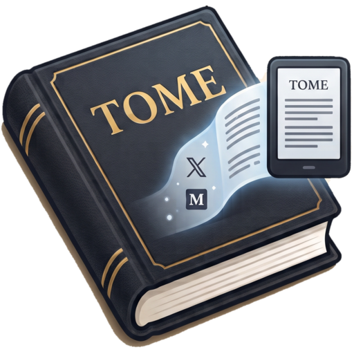

<p align="center">
  
</p>

<h1 align="center">Tome</h1>

Turn web articles into beautifully typeset, e-ink-optimized documents on your
Kindle. Today Tome handles **X (Twitter) articles** — long-form posts locked
behind login, unreachable by scrapers — with Medium, Substack, and general blogs
planned next.

**How it works:** a browser extension extracts the article from the live DOM of
the page you're already reading (so authentication is never an issue), then a
local Go server typesets it into a device-accurate PDF via headless Chrome and
delivers it to your Kindle by email.

```
Browser (you, logged in)          Local Go server (:8080)
┌───────────────────────┐         ┌──────────────────────────────┐
│ Tome extension        │  POST   │ /convert        → PDF / EPUB │
│  extractors/x.js      │ ──────▶ │ /send-to-kindle → Resend →   │
│  extractors/generic.js│  JSON   │                   your Kindle│
└───────────────────────┘         └──────────────────────────────┘
```

## Quick start

1. **Load the extension** — `arc://extensions` (or `chrome://extensions`) →
   Developer mode → *Load unpacked* → the [`extension/`](extension/) folder.
2. **Run the server** — `cd server && go run ./cmd/tome`
   (needs Go and any Chrome-family browser installed), then bootstrap your
   admin account: `go run ./cmd/tome init-admin --email you@example.com
   --kindle you@kindle.com` (prints your API key once).
3. In the popup → **Server settings**, paste the API key.
4. Open an X article, click the **Tome** toolbar button →
   **Send to Kindle** (or **Open reader tab** → `Cmd+P` → Save as PDF).

## Self-host for your friends

Tome is **multi-user and invite-only**: run one server, invite people, and each
person uses the extension with their own account and Kindle address. Email
delivery goes through [Resend](https://resend.com) (admin-configured); admin
work happens through the `tome admin` CLI — no web dashboard to babysit.

```bash
cd server
container build -t tome .      # or: docker build -t tome .
container volume create tome-data
container run --detach --name tome -p 8080:8080 -v tome-data:/data tome
container exec -u tome tome tome init-admin --email you@example.com --kindle you@kindle.com
tome admin settings set --resend-api-key re_… --resend-from tome@yourdomain.com
tome admin invites create --email friend@example.com --send
```

Friends redeem their invite code right in the extension popup. Full setup,
endpoint docs, and container caveats in [`server/README.md`](server/README.md).

## Layout

| Path | What it is |
|---|---|
| [`extension/`](extension/README.md) | Chrome/Arc MV3 extension: pluggable per-site extractors, e-ink reader tab, Send-to-Kindle popup. `reader.css` here is the single source of truth for typography. |
| [`server/`](server/README.md) | Local Go server: PDF (headless Chrome) / EPUB (fallback) rendering, SMTP or macOS Mail.app delivery. |
| [`docs/plan.md`](docs/plan.md) | Project plan and running status — design decisions, findings, what's next. |

## Highlights

- **Device-accurate pages** — Kindle Scribe 157×210 mm, Paperwhite 105×140 mm;
  the PDF renders 1:1 on the device, no magnification.
- **Dense e-ink typography** — Literata 9.5 pt, ~360 words/page on Scribe;
  tables, code blocks, and links (underline style) all preserved.
- **Dedicated X extractor** — reads X's stable `data-testid` landmarks for
  title, byline, date, cover image, and body; Readability.js as the generic
  fallback for any other page.
- **Zero-config delivery on macOS** — without SMTP credentials, Tome opens
  Mail.app with the PDF attached and your Kindle address filled in.
